# Boas Práticas {#sec-praticas}

Esta seção é dedicada a salientar alguns exemplos de boas práticas adotadas por Detrans a fim de demonstrar alguns costumes que podem aperfeiçoar o desempenho dos portais em geral. A escolha das menções nesta seção foi promovida em relação às maiores notas encontradas no estudo.

## Frota - Detran-RJ e BA

A @fig-rj  demonstra um gerenciador de tabelas disponível no portal do Detran-RJ, que apesar de não conter gráficos ou visualizações sobre os dados, possui um extenso intervalo temporal e um alto nível de desagregação das variáveis, fornecidos de forma interativa com filtros e tabelas dinâmicas. Já a @fig-ba é um bom exemplo de transparência ativa por utilizar um dashboard interativo. A ferramenta oferece clareza visual imediata através de gráficos de barras para ranking (frota por município) e permite ao usuário filtrar e detalhar a informação por diferentes variáveis (município, tipo de veículo, combustível), garantindo o acesso democrático aos dados.

::: {#fig-rj}
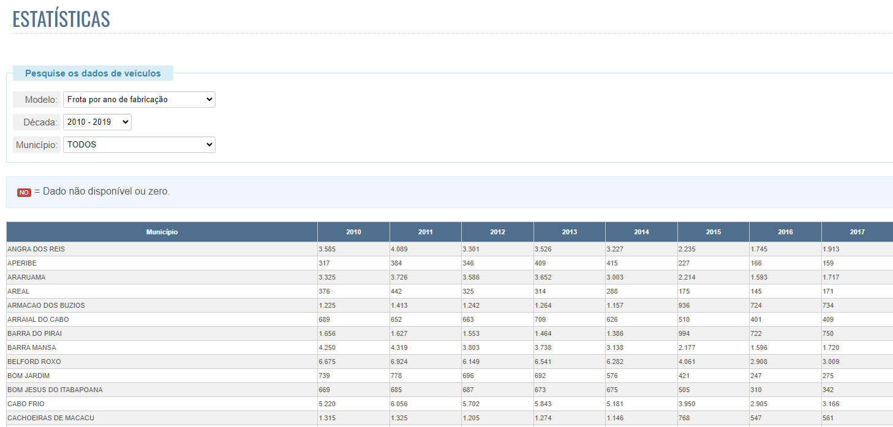

Gerenciador de Tabelas do Detran-RJ.\
Fonte: <https://www.detran.rj.gov.br/\_estatisticas.veiculos/index.asp>
:::

:::{#fig-ba}
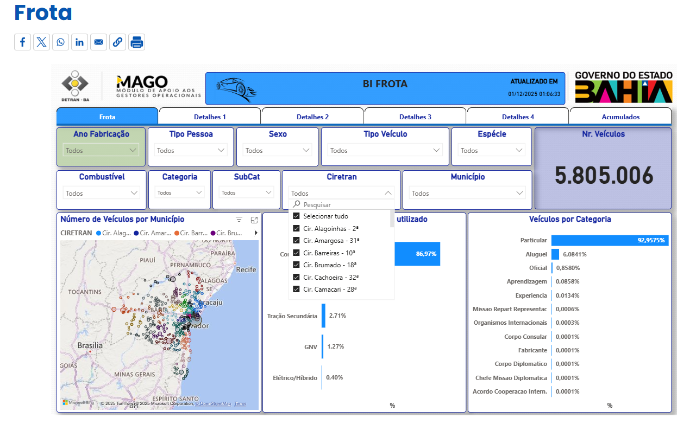

 Histórico de Frota da BA\
Fonte: <https://www.ba.gov.br/detran/frota/>
:::
## Condutores - Detran-RO E GO

Na @fig-ro, o Detran-RO disponibiliza os dados em um *dashboard*, ou relatório interativo, com filtros e gráficos dinâmicos para a visualização dos dados fornecidos, sendo implementado no *software* Power BI. O uso de programas de análise de dados para geração de relatórios interativos, como Tableau, Google Looker Studio e o anteriormente citado Microsoft Power BI, é uma prática muito recomendada aos departamentos em geral. Já na @fig-go, o Detran-GO integra diversos tipos de visualização, como mapas georreferenciados (para distribuição espacial) e tabelas detalhadas, fornecendo ao usuário uma visão completa.

::: {#fig-ro}
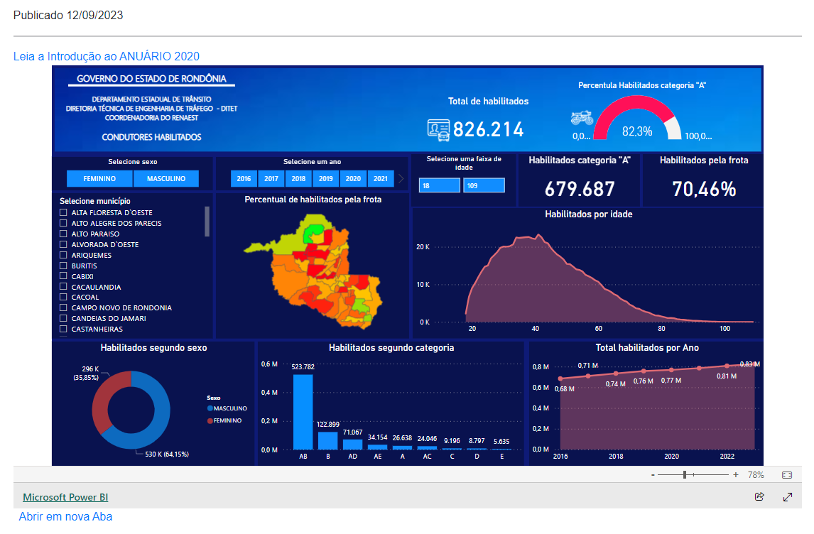

Dashboard de dados de condutores habilitados do Detran-RO\
Fonte: <https://www.detran.ro.gov.br/post/43/2023/9/12/anuario-estatistico-condutores-habilitados/>

:::

:::{#fig-go}
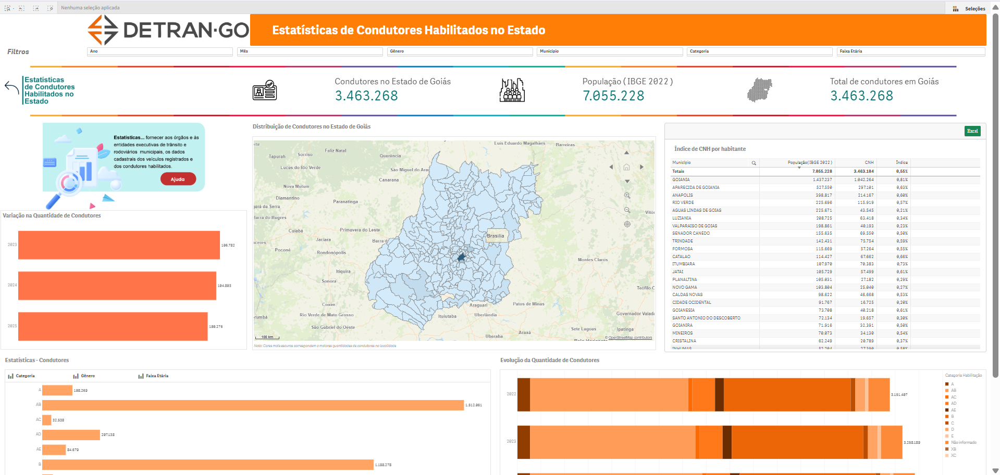

Dashboard de dados de condutores habilitados do Detran-GO\
Fonte: <https://paineis.detran.go.gov.br/extensions/Condutores/Condutores.html>
:::

## Infrações - Detran-PR E SP

Como anteriormente citado, uma boa prática para demonstração dos dados é a geração de dashboards através de programas de análise de dados. Na @fig-pr, o Detran-PR incorpora em seu portal visualizações dinâmicas.Exibe o total de multas, mas também as detalha por Natureza (Média/Grave/etc.) e lista as 15 infrações mais cometidas. Na @fig-sp o Detran-SP se destaca pela boa Prática na promoção de serviços digitais, ao utilizar um dashboard focado no Sistema de Notificação Eletrônica (SNE).

::: {#fig-pr}
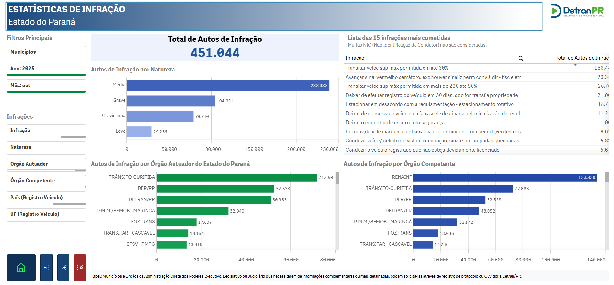

Dashboard de infrações do Detran-PR.\
Fonte: <https://bi2.pr.gov.br/single/?appid=93c1bb57-667b-4c26-acd3-ac2c02e5cc49&sheet=d07b2ca0-cc1d-4d82-b1e2-293ffb2c3e83&target=_self&lang=pt-BR&theme=sense&opt=ctxmenu&select=clearall&select=Ano,2025&select=M%C3%AAs,10>
:::

:::{#fig-sp}
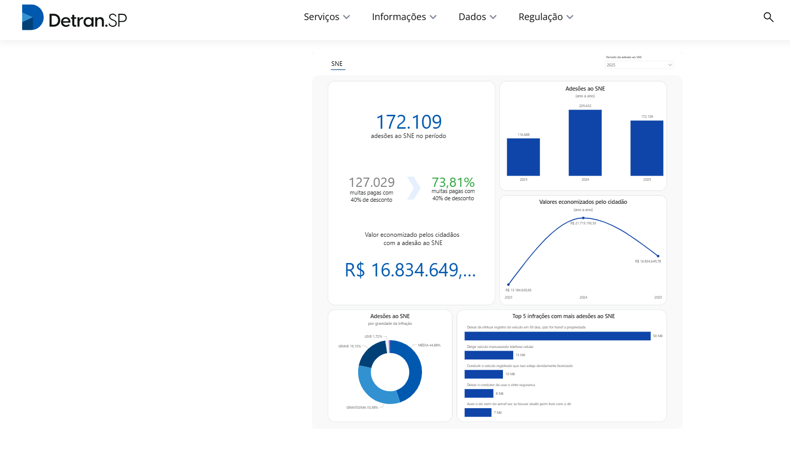

Dashboard de infrações do Detran-SP.\
Fonte: <https://www.detran.sp.gov.br/detransp?id=sne_dados>
:::

## Sinistros - Detran-SE E ES

Detran-SE e ES disponibilizam uma grande quantidade de níveis de desagregação, como visto na @fig-se-1 e @fig-es-1.

::: {#fig-se-1}
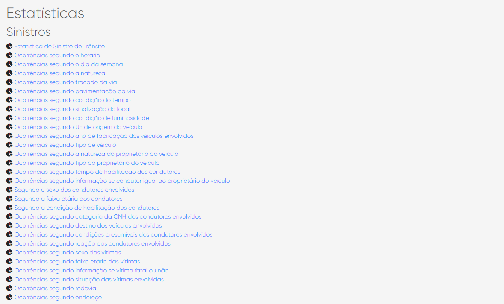

Página de estatísticas de sinistros do Detran-SE.\
Fonte: <https://www.detran.se.gov.br/?pg=estatistica/acidentes#gsc.tab=0>
:::

Seus dados são apresentados em tabelas dinâmicas, com filtros e um extenso intervalo temporal, como apresenta a @fig-se-2.

::: {#fig-se-2}
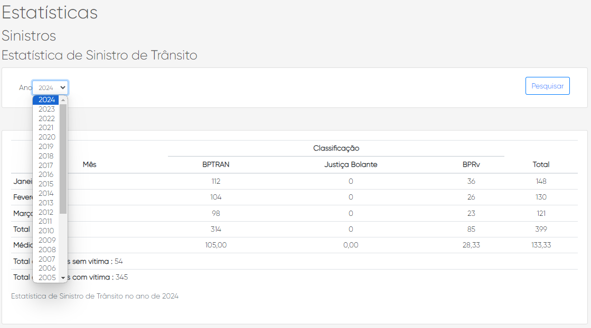

Exemplo de tabela dinâmica do Detran-SE.\
Fonte: <https://www.detran.se.gov.br/?pg=estatistica/acidentes/boat_001#gsc.tab=0>
:::

::: {#fig-es-1}
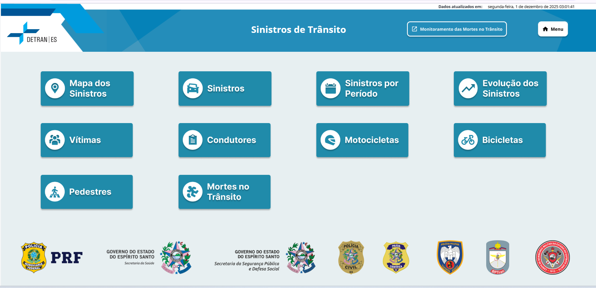

Exemplo de tabela dinâmica do Detran-ES.\
Fonte: <https://analitico.sides.es.gov.br/SASVisualAnalytics/?reportUri=%2Freports%2Freports%2F8af22e94-6e3c-45d2-b8eb-085c6f1ee077&sectionIndex=0&sso_guest=true&reportViewOnly=true&reportContextBar=false&pageNavigation=false&sas-welcome=false>
:::
## Atendimento ao Público - Detran-SP
Além de providenciar contato por telefone, e-mail e mensagem via WhatsApp, o serviço de atendimento do Detran-SP oferece a possibilidade de registrar manifestações personalizadas pelo próprio portal (@fig-sp-1) e aplicativos para auxílio ao público (@fig-sp-2).

::: {#fig-sp-1}
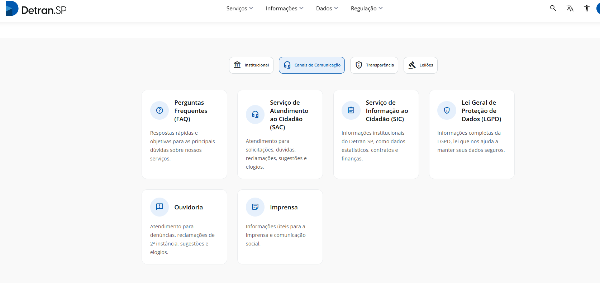

Serviço de atendimento pelo portal do Detran-SP.\
Fonte: <https://www.detran.sp.gov.br/detransp/pb/informacoes/canais_de_comunicacao?id=canais_de_comunicacao>
:::

::: {#fig-sp-2}
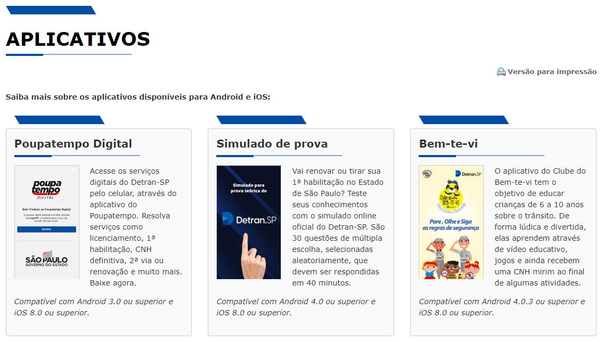

Aplicativos do portal do Detran-SP.\
Fonte: <https://www.detran.sp.gov.br/wps/portal/portaldetran/cidadao/appsdetran>
:::

## Sinistros - Detran-SP

O novo painel do sistema Infosiga (Sistema de Informações Gerenciais de Sinistros de Trânsito) integra os dados referentes a sinistros e suas vítimas, com base nas ocorrências dentro do Estado de São Paulo. No dia 16/05/2024 houve o lançamento da nova versão deste sistema, que está ilustrado na @fig-infosiga

::: {#fig-infosiga}
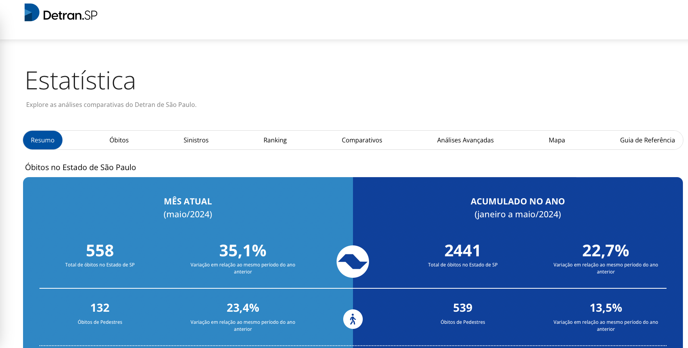

Novo Infosiga \
Fonte: <https://www.infosiga.sp.gov.br/>
:::

## Educação para o Trânsito - Detran-PR

A @fig-pr-educ apresenta o portal educativo do Detran-PR, que dispõe de uma grande variedade de materiais e divulgações sobre a educação e conscientização para o trânsito disponíveis em diversos formatos digitais, como vídeos, cursos EaD, *podcasts*, entre outros.

::: {#fig-pr-educ}
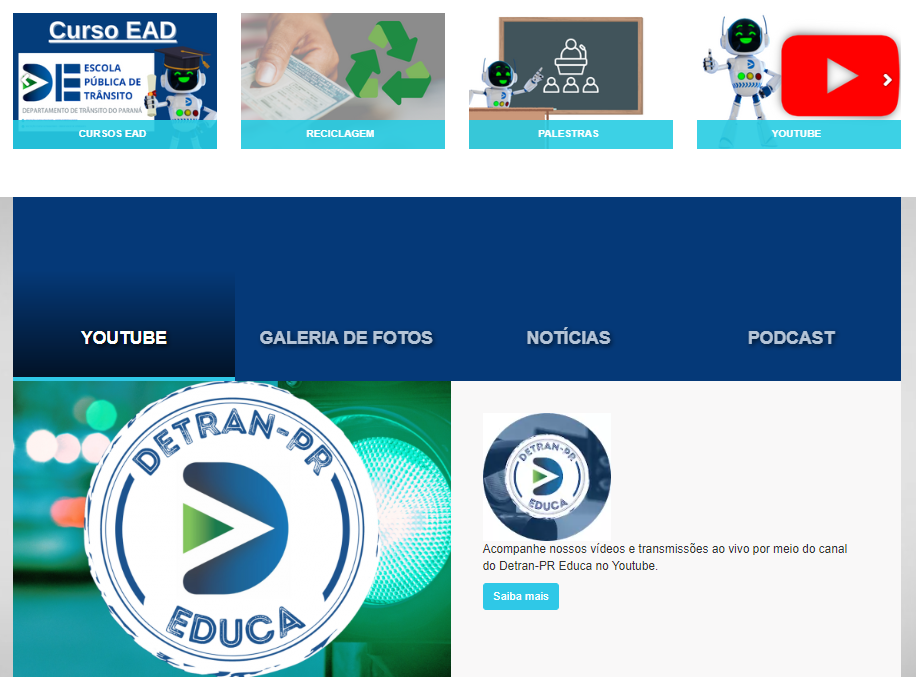

Portal de educação do Detran-PR.\
Fonte: <https://www.detraneduca.pr.gov.br/>
:::

## CFCs - Detran-PR

O Detran-PR também possui em seu portal tabelas interativas para a consulta de CFCs de forma dinâmica e eficiente, como demonstrado na @fig-pr-cfcs.

::: {#fig-pr-cfcs}
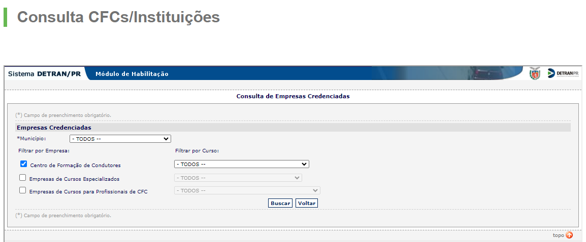

Lista de CFCs/Instituições do Detran-PR.\
Fonte: <https://www.detran.pr.gov.br/Pagina/CFCInstituicoes-Cursos-de-Capacitacao-e-Especializados>
:::

## Sinistros - Detran-RO

O Detran-RO possui o Observatório de Trânsito , disponibilizando dados sobre sinistros, frota de veículos, condutores habilitados e infrações. Ele não apenas apresenta o dado (como os anteriores), mas também ensina o usuário a interagir com a ferramenta

::: {#fig-ro-obs}
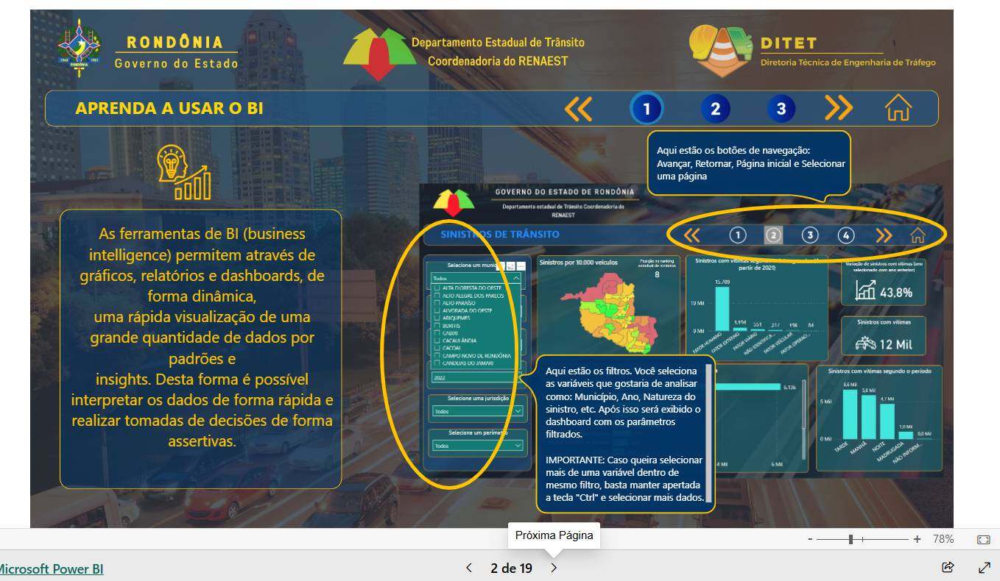

Observatório de Trânsito do Estado de Rondônia. \
Fonte: <https://www.detran.ro.gov.br/post/39/2023/9/12/anuario-estatistico-de-sinistros-de-transito-de-rondonia/>
:::